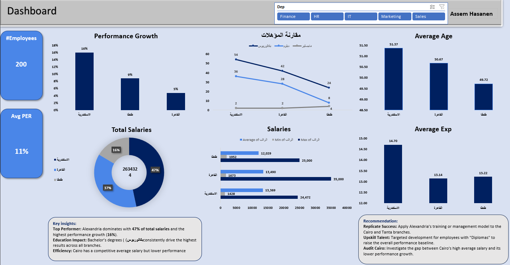

# HR Performance & Salary Analytics Dashboard

## 📊 Dashboard Preview
 

## 🎯 Project Objective
This project transforms raw HR data into actionable business insights. By analyzing performance trends, salary distributions, and education impacts across multiple branches (Alexandria, Cairo, Tanta), this tool helps HR management make data-driven decisions.

## 🛠️ Data Cleaning & Transformation (Power Query)
* **Multi-Source Integration:** Appended all individual data sheets via Power Query to create a single, dynamic HR Master Table.
* **Data Quality:** Corrected data types and resolved naming inconsistencies across branch locations.
* **Null Management:** Applied "Fill Down" logic for missing Department fields to ensure 100% data integrity.

## 🧠 KPI Development & Logic Design
* **Tenure Tracking:** Calculated Employee Age and HR experience tenure using precise date-diff logic.
* **Performance Benchmarking:** Aggregated multiple HR performance metrics to establish a baseline for success.
* **Growth Analytics:** Engineered a "Performance Delta" column to calculate year-over-year growth (%).

## 💡 Key Insights & Recommendations
* **Top Branch:** Alexandria leads with 47% of salary spend but returns the highest performance growth (16%).
* **Education Factor:** Employees with Bachelor's degrees (بكالوريوس) drive the highest performance results.
* **Recommendation:** Investigate the gap in Cairo where higher salaries are not yet reflecting the performance growth seen in other regions.
